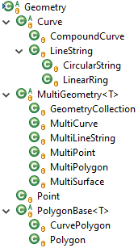
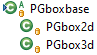

# PostGIS Java bindings (Next Generation) #

[](https://github.com/sebasbaumh/postgis-java-ng/actions/workflows/codeql-analysis.yml)
[](https://search.maven.org/artifact/io.github.sebasbaumh/postgis-java-ng)
[](https://javadoc.io/doc/io.github.sebasbaumh/postgis-java-ng/latest/index.html)
[](https://github.com/sebasbaumh/postgis-java-ng/blob/master/LICENSE)

[](https://sonarcloud.io/dashboard?id=sebasbaumh_postgis-java-ng)
[](https://sonarcloud.io/dashboard?id=sebasbaumh_postgis-java-ng)
[](https://sonarcloud.io/dashboard?id=sebasbaumh_postgis-java-ng)
[](https://sonarcloud.io/dashboard?id=sebasbaumh_postgis-java-ng)

This project contains Java bindings for using [PostGIS](https://postgis.net/) geometries coming from a [PostgreSQL](https://www.postgresql.org/) database.  
*It is originally based on [postgis-java](https://github.com/postgis/postgis-java) and I want to thank its authors for their work.*

**Project goals and improvements:**
* Support for geometries containing arcs like `CIRCULARSTRING` or `CURVEPOLYGON`
* Support for PostGIS [geography datatype](https://postgis.net/docs/using_postgis_dbmanagement.html#PostGIS_Geography)
* Extended support for bounding boxes, i.e. [box2d](https://postgis.net/docs/box2d_type.html)/[box3d](https://postgis.net/docs/box3d_type.html) PostGIS data types (as PGbox2d/PGbox3d)
* Support for wrapped connections (like used in WildFly and c3p0 connection pooling)
* Use generic Java types where possible and simplify/streamline API
* Clean up code to basically only work on [WKB](https://en.wikipedia.org/wiki/Well-known_text#Well-known_binary)/EWKB implementations to reduce code duplication and focus on the actual database format
* Support for binary transfer of geometry data (if enabled in PostgreSQL JDBC driver)
  * use PostgreSQL JDBC driver [42.5.1](https://jdbc.postgresql.org/changelogs/2023-01-31-42.5.2-release/) or later to enable it automatically
* Support for the latest PostgreSQL and PostGIS versions
  * Recommended are PostgreSQL 15.1 and PostGIS 3.2.2
  * Supported are versions starting from PostgreSQL 9.6 and PostGIS 2.3
* Support for current JDKs
  * JDK 21 ([main branch](https://github.com/sebasbaumh/postgis-java-ng/tree/master))
  * deprecated branches
    * [JDK 17](https://github.com/sebasbaumh/postgis-java-ng/tree/jdk17)
    * [JDK 11](https://github.com/sebasbaumh/postgis-java-ng/tree/jdk11)
    * [JDK 8](https://github.com/sebasbaumh/postgis-java-ng/tree/jdk8)
* The [license](https://github.com/sebasbaumh/postgis-java-ng/blob/master/LICENSE) is still LGPL
* The authors are listed [here](https://github.com/sebasbaumh/postgis-java-ng/blob/master/AUTHORS)

**Supported [geometry types](https://postgis.net/docs/using_postgis_dbmanagement.html#RefObject):**
* `Point`
* `LineString`
* `CircularString`
* `CompoundCurve`
* `Polygon`
* `CurvePolygon`
* `MultiPoint`
* `MultiLineString`
* `MultiCurve`
* `MultiPolygon`
* `MultiSurface`
* `GeometryCollection`
* `box2d`
* `box3d`

## How to use it ##
There is a Maven artifact in the official Maven repository, so just add this to your Maven POM:

```xml
<dependency>
	<groupId>io.github.sebasbaumh</groupId>
	<artifactId>postgis-java-ng</artifactId>
	<version>24.1.1</version>
</dependency>
```

The version reflects the year of the release, e.g. `24.1.1` is a version released in 2024.

The API differs a bit from [postgis-java](https://github.com/postgis/postgis-java) with the main point being a different namespace (`io.github.sebasbaumh.postgis`) as publishing a project to Maven Central requires to own that namespace.
In addition the class structure is a bit different (see below) to support arc geometries and reduce boilerplate code, but you should be able to adapt to it easily.
The implementations of the parser and writer for the geometries have been heavily reworked to speed up processing and reduce complexity.

## Hierarchy of geometry classes: ##





## How to run tests utilizing a PostgreSQL server ##

You will need a PostgreSQL server with installed PostGIS extension for some of the tests.

In this example the server is named `MyServer` and the database `UnitTestDB`. The database can be empty except installing the PostGIS extension.

You should set up a database user for the unit tests, which has access rights to this database and only to this one.
In this example the user is called `unittest` and has the password `CHANGEME`.

To run the unit tests accessing the server, add the following to your VM arguments (eclipse Run Configuration->Arguments->VM arguments):

`-DtestJdbcUrl="jdbc:postgresql://MyServer/UnitTestDB" -DtestJdbcUsername="unittest" -DtestJdbcPassword="CHANGEME"`

Or add the following Maven build parameters to the launch configuration in eclipse:

|Parameter Name|Value|
|--------------|-----|
|`testJdbcUrl`|`jdbc:postgresql://MyServer/UnitTestDB`|
|`testJdbcUsername`|`unittest`|
|`testJdbcPassword`|`CHANGEME`|

If it works, you will see this line in the build output:

```
Tests are running with a database
```

else

```
Tests are running without a database
```

*There are also local tests contained in the project, so you are still able to test most parts without specifying a PostgreSQL server. And the test console output will show if tests were run with or without a database.*
